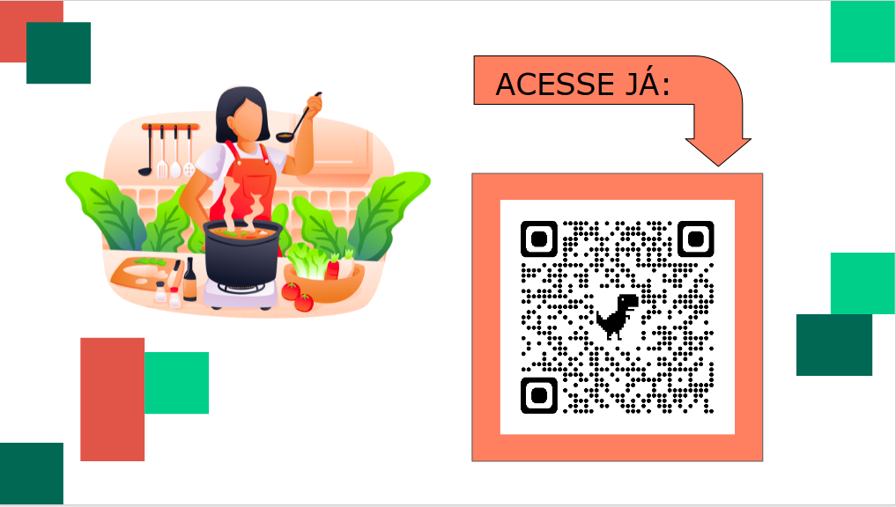

### Projeto App de Receitas

Este projeto visa entregar uma aplicação que lista receitas, foi desenvolvido em grupo durante o curso da Trybe.
O estilo do projeto foi desenvolvido para ser mobile only.

# Tecnologias utilizadas

- React.js
- Context API
- React Hooks
- CSS3
- Slack
- Zoom
- Trello

# Instalando dependências

Primeiramente você deve realizar o clone deste repositório, você pode fazê-lo por meio do comando `git clone git@github.com:alvarogularte/recipes-app.git`
Em seguida, será necessário acessar o diretório do projeto, com o comando `cd sd-015-a-project-recipes-app`
E utilize o comando `npm install` para instalar as dependências necessárias.
Rode o comando `npm start` para que a aplicação rode em sua máquina e boas receitas!!!

# Funcionalidades do projeto

- Filtros de pesquisa.
- Compartilhamento de receitas.
- Opção de favoritar receitas.
- Telas de login, comidas, bebidas, explorar, receitas em andamento, receitas favoritadas, receitas feitas e perfil.

# Deploy do projeto

Link para o deploy do projeto: https://recipe-app-ecru.vercel.app/

